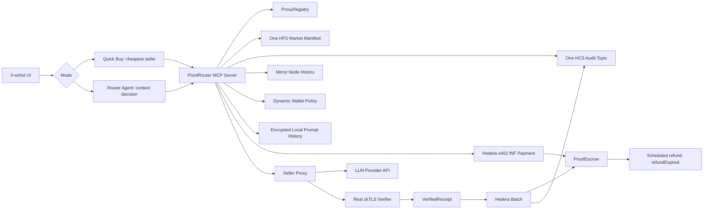

# Lean PRD v5: 0-wAIst — AI Subscription De-Re-Seller Router Agent

**Purpose:** A self-contained, lean Product Requirements Document for Codex Desktop running with a WSL2 backend.

**Product name:** `0-wAIst — AI Subscription De-Re-Seller Router Agent`  
**Short name:** `0-wAIst`  
**Repo name:** `0-waist-inference`  
**Primary chain:** Hedera Testnet  
**Primary bounty target:** Hedera AI & Agentic Payments  
**Build posture:** one direct implementation path, no legacy/fallback paths, no duplicate business logic, no formula router, no decorative integrations.

---

## Implementation status — 2026-06-14

Current branch: `codex/full-p0-continuation`

### Built

- [x] pnpm workspace skeleton with TypeScript packages, service, Vite frontend, demo scripts, and static forbidden-pattern check.
- [x] Shared schemas for offers, orders, receipts, tools, traces, and prompt history.
- [x] Shared hash, redaction, and AES-GCM local encryption helpers.
- [x] ProofRouter service with one shared `executeInferenceOrder` workflow for Quick Buy and Router Agent.
- [x] ProofRouter MCP stdio server using the official MCP TypeScript SDK, with real protocol smoke coverage.
- [x] Seeded Alpha/Beta/Gamma seller offers.
- [x] Dynamic registered-offer marketplace cache, shared by API, MCP, demo script, and frontend.
- [x] Live seller offer publication through `ProxyRegistry.publishOffer`; registry offer `1`, transaction `0.0.9186037@1781396121.704889572`.
- [x] Seller onboarding frontend panel for local-save or Hedera publish, with pricing, endpoint, account, and HashScan result state.
- [x] Seller-node service exposing `/health`, `/x402`, and OpenAI-compatible `/v1/chat/completions` guarded by structured escrow evidence headers.
- [x] Quick Buy deterministic cheapest compatible seller selection.
- [x] Router Agent selection through a real OpenAI LLM call when `mode=router-agent`.
- [x] Real OpenAI Responses API answer generation from the server.
- [x] Hedera SDK helpers for HCS audit topic creation, hash-only HCS message submission, HFS manifest creation/read, and HashScan links.
- [x] Live Hedera Testnet HCS topic `0.0.9226268`.
- [x] Live Hedera Testnet HFS market manifest `0.0.9226269`.
- [x] Live Hedera Testnet HTS `INF` token `0.0.9226625`.
- [x] Live Hedera Testnet contracts: `ProxyRegistry` `0.0.9226646`, `ProofEscrow` `0.0.9226648`, `VerifierRegistry` `0.0.9226643`.
- [x] Local verifier EVM signer generated into ignored `.env` and approved in live `VerifierRegistry`; approval transaction `0.0.9186037@1781391308.700334793`.
- [x] Local verifier placeholder now signs `ProofEscrow`-compatible `VerifiedReceipt` payloads while Chainlink CRE login is blocked. This is executable demo evidence, not trusted CRE completion evidence.
- [x] Live API order audit transaction visible on HashScan: `0.0.9186037@1781386460.953715803`.
- [x] Live HFS manifest refresh transaction visible on HashScan: `0.0.9186037@1781389738.626703938`.
- [x] Minimal Vite frontend showing prompt input, mode, budget, selected route, proof/payment status, answer, seller candidates, timeline, and HashScan action.
- [x] Frontend can prepare a `ProofEscrow.openOrder` x402 escrow transaction for sellers with numeric `registryOfferId`.
- [x] Frontend/API Hedera action readiness for INF, contracts, x402 escrow, seller registry publication, refund schedule, and batch settlement.
- [x] Frontend/API read-only Mirror Node diagnostics for buyer/seller INF association, buyer INF balance, and ProofEscrow INF allowance.
- [x] Hedera SDK helper to ABI-encode, build, and submit `ProofEscrow.openOrder(offerId, promptHash, requestHash, deadline)`.
- [x] ProofRouter HTTP/MCP path prepares `ProofEscrow.openOrder` calldata and blocks live submission until the configured signer is confirmed as the buyer wallet.
- [x] Hedera SDK helper to create a scheduled transaction targeting `ProofEscrow.refundExpired(orderId)`.
- [x] Hedera SDK helper to build/submit a native batch containing `ProofEscrow.settle` and a hash-only HCS receipt message.
- [x] Hedera Agent Kit package import/readiness wired through `@hashgraph/hedera-agent-kit` core plugins.
- [x] Demo scripts: `pnpm demo:deploy`, `pnpm demo:verifier`, `pnpm demo:seed`, `pnpm demo:judge`, `pnpm demo:health`, `pnpm test:e2e`, `pnpm mcp`.
- [x] Solidity contract source for `ProxyRegistry`, `ProofEscrow`, and `VerifierRegistry`, including INF locking, verifier-gated settlement, and only `refundExpired` for timeout.

### Verified

- [x] `pnpm build` passes.
- [x] `pnpm test` passes.
- [x] `pnpm test:e2e` passes.
- [x] Real OpenAI smoke ran through `pnpm demo:judge`.
- [x] `pnpm demo:seed` creates visible Hedera Testnet HCS activity.
- [x] `pnpm demo:seller` publishes a live seller offer to `ProxyRegistry` and stores the local marketplace cache.
- [x] `pnpm demo:deploy` creates/loads HTS `INF` and deploys the three Hedera EVM contracts.
- [x] Local API order endpoint submits hash-only HCS audit messages and returns HashScan links.
- [x] `pnpm demo:health` passes for the placeholder demo path with `trustedCreReady=false`, Dynamic/x402/scheduled refund ready, local verifier placeholder ready, and trusted Chainlink CRE fields still listed under `trustBlockedBy`.

### Minimal scanner demo

- [x] Frontend running locally at `http://localhost:5173`.
- [x] API running locally at `http://localhost:8787`.
- [x] Seller node running locally at `http://localhost:8790`.
- [x] Real OpenAI call path working.
- [x] Real Hedera Testnet scanner activity working.
- [x] Real seller registry activity working.

### Not yet complete for full P0

- [x] HTS `INF` creation.
- [x] Hedera EVM contract deployment.
- [x] Seller offer publication into `ProxyRegistry`.
- [x] `ProofEscrow.openOrder` transaction builder and ProofRouter preparation path.
- [x] Read-only Mirror Node validation for buyer/seller INF association and buyer ProofEscrow allowance.
- [ ] Buyer/seller INF association, funding, and allowance execution through the real wallet path.
- [ ] Live buyer-wallet contract call for order open, plus live settlement and refund execution.
- [ ] Dynamic wallet login/delegated policy.
- [ ] Hedera x402 INF escrow funding.
- [x] Local verifier placeholder signing path.
- [ ] Trusted Chainlink CRE / real zkTLS verifier integration, deferred until CRE deploy access, workflow, Reclaim provider, and Sepolia receiver/target exist.
- [ ] Real zkTLS provider proof policy wired to the trusted verifier path.
- [ ] Scheduled refund execution for a real funded order.
- [ ] Native Hedera batch settlement execution plus HCS receipt for a real verified receipt.
- [x] Hedera Agent Kit package and core plugin readiness wiring.
- [ ] Cloudflare Pages deployment credentials and project publish.

---

## 0. Lean implementation doctrine

Codex must optimize for a small, maintainable, robust codebase.

### Non-negotiable rules

1. **One product path.** All inference orders use the same payment/proof/settlement path:

   ```text
   select seller -> x402 funds ProofEscrow with HTS INF -> scheduled refund created -> seller proxy call -> real zkTLS receipt -> Hedera Batch settles + writes HCS audit
   ```

2. **Two selection modes only.** Quick Buy uses deterministic cheapest compatible seller selection. Router Agent uses context and MCP tools. They share the same order execution path.
3. **No duplicate logic.** Shared schemas, hash helpers, redaction, receipt validation, order execution, HCS message building, and trace writing must each have one canonical implementation.
4. **No formula router.** Do not add weighted scoring, route scores, or hidden routing formulas for Router Agent.
5. **No plaintext prompt leakage.** Raw prompts never go to chain, HCS, HFS, public logs, public trace files, or explorer-visible metadata.
6. **No broad adapters.** Use explicit clients at required external boundaries only: Hedera, Dynamic, x402, zkTLS, MCP, and provider API. Do not create generic `PaymentAdapter`, `ChainAdapter`, or fallback strategy layers.
7. **Prefer clear general code.** Avoid special-case code and micro-optimizations unless needed for correctness.
8. **Fail fast.** If a locked P0 integration is unavailable, `pnpm demo:health` fails with a structured error.

---

## 1. Locked decisions

| Decision | Locked choice | Consequence |
|---|---|---|
| 1A | Live scheduled refund execution in P0 | Use one timeout function: `ProofEscrow.refundExpired(orderId)`. Create and demonstrate a Hedera Scheduled Transaction targeting it. No `expireOrder`; no manual-refund demo path. |
| 2A | One CRE-selected settlement shell in P0 | The current Hedera Batch helper supports the placeholder demo path while CRE is unavailable. Current CRE discovery says Hedera is not directly listed as a supported workflow chain, so the later trusted path is Sepolia CRE settlement plus Hedera HCS/HFS audit unless CRE Hedera support changes. Do not keep duplicate settlement shells live. |
| 3A | HTS `INF` token for P0 escrow and Quick Buy | `INF` is the only product settlement asset. HBAR is only for fees/gas. |
| 4A | Real zkTLS mandatory in P0 | End-to-end settlement requires real zkTLS proof verification. No demo verifier/stub path. |
| 5A | Full Hedera x402 Quick Buy in P0 | Quick Buy uses real `402 Payment Required` and Hedera x402 with `INF`; the x402 payment funds `ProofEscrow`, not final seller payment. |
| 6A | Live Dynamic/Fireblocks wallet in P0 | User UI uses Dynamic wallet infrastructure and bounded delegated agent spending. No alternate live wallet path. |
| 7A | Real MCP server in P0 | Product actions go through a real `proofrouter-mcp` server. No HTTP-only tool substitute. |
| 8A | Local encrypted prompt-history viewer in P0 | Dashboard shows local encrypted prompt history with summaries and redaction controls. |

Temporary execution note, 2026-06-14: Chainlink CRE deploy access is requested but not enabled, no CRE workflow exists, Reclaim has no provider configured, and Hedera is not directly listed as a CRE-supported workflow chain. Until the Sepolia CRE settlement path in `plans/sepolia-cre-settlement-hedera-audit-plan.md` is implemented, the executable demo path may use the approved local verifier placeholder to sign `ProofEscrow`-compatible receipts. `pnpm demo:health` must label this as `local-verifier-placeholder` with `trustedCreReady=false`; it must not claim trusted CRE / real zkTLS completion or direct CRE-to-Hedera settlement.

This note supersedes older native-Hedera-batch settlement wording for trusted CRE completion. Hedera remains the audit and manifest layer; Sepolia is the planned CRE-supported settlement chain unless Chainlink CRE later exposes direct Hedera workflow support.

Allowed test doubles:

```text
- Solidity unit tests may use mock accounts/signers.
- Service unit tests may mock external clients only at external boundaries.
- P0 integration/E2E tests and live demo must use the locked real paths.
```

---

## 2. Codex Desktop + WSL2 operating instructions

Assume:

```text
Codex Desktop app: Windows native
Codex agent/runtime: WSL2
Repo location: WSL filesystem, e.g. ~/code/0-waist-inference
Docker: Docker Desktop with WSL2 backend
Frontend/demo browser: native Windows Chrome
```

Required commands:

```bash
pnpm install
pnpm build
pnpm test
pnpm test:e2e
pnpm demo:seed
pnpm demo:judge
pnpm demo:health
```

Development constraints:

```text
- Use WSL filesystem, not /mnt/c.
- Use pnpm workspaces.
- Use TypeScript for services.
- Use Solidity for contracts.
- Keep README.md as the presentation surface.
- Keep the live demo under 3 minutes.
```

---

## 3. Executive summary

`0-wAIst — AI Subscription De-Re-Seller Router Agent` has two layers.

### Layer 1: Quick Buy

```text
Buyer enters prompt and budget.
Quick Buy reads offers and selects the cheapest compatible seller.
Seller proxy returns HTTP 402 Payment Required.
Dynamic wallet pays HTS INF through Hedera x402 into ProofEscrow.
ProofEscrow opens the order and locks INF.
A scheduled refund transaction is created for the order.
Seller performs real direct zkTLS provider API call.
Verifier signs VerifiedReceipt only after real proof verification.
Native Hedera Batch Transaction settles escrow and writes HCS receipt log.
```

### Layer 2: Router Agent

```text
Buyer enters prompt and budget.
Router Agent receives marketplace offers, one HFS market manifest, HCS/Mirror seller history, local encrypted prompt history, Dynamic policy, and MCP tools.
Router Agent chooses seller from context.
The same x402 -> ProofEscrow -> scheduled refund -> seller proxy -> real zkTLS -> batch settlement path executes.
```

The two layers differ only in seller selection.

```text
Quick Buy seller selection: deterministic cheapest compatible offer.
Router Agent seller selection: agent decision from context through MCP.
```

---

## 4. One-line pitch

> 0-wAIst lets users de-resell AI subscription capacity through verified proxy sellers, while a router agent buys the cheapest safe route using Dynamic wallets, Hedera x402, HTS INF escrow, seller history, local prompt history, and real zkTLS receipts.

---

## 5. Goals

1. Sellers publish LLM proxy offers and INF prices.
2. Quick Buy purchases the cheapest compatible verified route.
3. Router Agent chooses a seller from context without formula scoring.
4. All orders use `ProofEscrow` funded through Hedera x402 in HTS `INF`.
5. Seller final payment is released only after real zkTLS receipt verification.
6. Scheduled refund executes on Hedera Testnet for an expired order.
7. Native Hedera Batch Transaction settles escrow and writes HCS receipt log.
8. Dynamic wallet and delegated policy are live in the user path.
9. One HCS audit topic and one HFS market manifest support audit and context without file/topic sprawl.
10. README and demo show real HashScan/HCS/HFS/Mirror/local trace artifacts.

---

## 6. Non-goals

Do not implement in P0:

```text
provider dashboard verification
stored-response proof
TEE proof
multi-chain routing
Walrus prompt resale
OpenRouter parity
complex HTS custom-fee economy
HTS reputation badge NFTs
ERC-8004 contract implementation
alternative wallet providers
formula seller scoring
manual demo fallback paths
parallel HBAR settlement path
multiple HCS topics
per-seller HFS files unless the single manifest exceeds file limits
```

ERC-8004/HCS-14-style identity metadata may appear in the HFS market manifest and HCS records. Do not deploy a separate ERC-8004 registry in P0.

---

## 7. Minimal architecture



### Intentional simplifications

```text
one HCS audit topic with typed messages
one HFS market manifest file
three Solidity contracts only
one guardrails module
one trace directory format
one MCP server
one order execution workflow shared by Quick Buy and Router Agent
```

---

## 8. Product flows

### 8.1 Quick Buy

1. User selects `Quick Buy`.
2. User enters prompt and max budget.
3. MCP reads offers from `ProxyRegistry` and metadata from the HFS market manifest.
4. MCP selects the cheapest compatible active offer.
5. Seller proxy returns real `402 Payment Required`.
6. Dynamic wallet pays HTS `INF` through Hedera x402 to fund `ProofEscrow`.
7. `ProofEscrow.openOrder` locks INF and records hashes.
8. MCP creates scheduled refund transaction targeting `ProofEscrow.refundExpired(orderId)`.
9. Seller serves only after escrow funding is confirmed.
10. Seller performs real direct zkTLS provider API call.
11. Verifier signs `VerifiedReceipt` after proof verification.
12. MCP submits native Hedera Batch Transaction containing `ProofEscrow.settle` and HCS receipt log.
13. UI returns answer and proof/payment status.

Quick Buy may use deterministic code:

```text
Filter: active, model-compatible, proofMode=direct_zktls_api, within budget, x402 endpoint present.
Sort: advertised INF price.
Pick: first result.
```

### 8.2 Router Agent

1. User selects `AI Subscription De-Re-Seller Router Agent`.
2. User enters prompt and max budget.
3. MCP builds context packet:
   - active offers from `ProxyRegistry`
   - one HFS market manifest
   - seller history from Mirror Node
   - HCS audit history
   - Dynamic wallet policy and remaining budget
   - local encrypted buyer prompt history
4. Agent decides which seller to use.
5. Agent outputs structured decision: selected seller, rejected alternatives, planned tools.
6. Steps 5–13 from Quick Buy execute using the selected seller.

Forbidden route code:

```text
scoreRoutes
route_score
price_weight
privacy_weight
reputation_weight
weighted_score
```

Allowed support code:

```text
build context packet
validate budget
validate offer activity
validate proof requirements
enforce guardrails
call MCP tools
validate structured agent decision
```

---

## 9. Hedera usage requirements

### 9.1 Agent Kit

Use Hedera Agent Kit as the action layer inside MCP tools where practical. Do not create a separate `hedera-tools` service.

Required actions:

```text
execute EVM contract calls
create/submit HCS messages
create/read HFS file
create/transfer/associate HTS INF token
query balances and transaction records
create scheduled transaction
submit batch transaction
```

### 9.2 Guardrails

Implement one module:

```ts
assertAgentActionAllowed(action, context)
```

It covers:

```text
max budget
allowed contracts: ProxyRegistry, ProofEscrow, VerifierRegistry
no plaintext prompt/response in HCS
escrow-before-proxy for both modes
proof-before-settle
Dynamic delegated policy
```

Do not create many policy classes unless Agent Kit requires wrappers; the canonical logic remains in `assertAgentActionAllowed`.

### 9.3 Hedera EVM contracts

Deploy only:

```text
ProxyRegistry.sol
ProofEscrow.sol
VerifierRegistry.sol
```

### 9.4 HTS INF

Create/configure one HTS fungible token:

```text
Token name: 0-wAIst Inference Credit
Symbol: INF
Decimals: 8
Use: every product payment and escrow settlement
```

### 9.5 HCS

Use one audit topic:

```text
0waist.audit
```

Message types:

```text
DECISION
RECEIPT
TIMEOUT
SETTLEMENT
```

Messages are hash-only.

### 9.6 HFS

Use one HFS file:

```text
0-waist-market-manifest.json
```

It contains seller IDs, endpoints, x402 endpoints, MCP endpoint, HCS audit topic, contract addresses, proof policy ID/hash, supported models, payment asset `INF`, ERC-8004-style service metadata, and HCS-14-style agent IDs.

Do not create per-seller HFS files unless the single file exceeds Hedera file limits.

### 9.7 Mirror Node

Use Mirror Node only to summarize seller history for the agent context:

```ts
get_seller_hedera_history(sellerAccount: string)
```

Return a plain-language evidence summary and recent relevant transaction references. Do not calculate formula scores.

### 9.8 Scheduled Transactions

Use one timeout function:

```solidity
function refundExpired(uint256 orderId) external;
```

P0 requires a Hedera Scheduled Transaction targeting this function and a timeout demo/test that observes execution on Hedera Testnet.

### 9.9 Batch Transactions

P0 requires one Hedera Batch Transaction after real zkTLS verification:

```text
1. ProofEscrow.settle(receipt, verifierSignature)
2. HCS audit topic message type RECEIPT
```

If the batch fails, the product fails loudly. No sequential product path exists.

### 9.10 x402

Quick Buy and Router Agent order funding use Hedera x402 to fund `ProofEscrow` in INF. The seller proxy may serve only after escrow funding is confirmed.

Required 402 payload fields:

```text
offerId
sellerId
modelId
network=hedera-testnet
paymentAsset=INF
escrowContract
maxInfAmount
proofMode=direct_zktls_api
requestHash
```

### 9.11 Dynamic / Fireblocks

User UI must use Dynamic wallet infrastructure:

```text
connect wallet
show INF balance
delegate bounded agent policy
use delegated policy for both Quick Buy and Router Agent order funding
```

Minimal policy object:

```json
{
  "maxSpendPerOrderInf": "0.50",
  "dailyLimitInf": "5.00",
  "allowedContracts": ["ProxyRegistry", "ProofEscrow", "VerifierRegistry"],
  "allowedSellersFromRegistryOnly": true,
  "expiresAt": "2026-06-14T00:00:00-04:00"
}
```

---

## 10. Smart contract specifications

### 10.1 `ProxyRegistry.sol`

```solidity
struct Offer {
    address seller;
    bytes32 providerId;
    bytes32 modelId;
    bytes32 endpointId;
    uint256 inputPricePerMTok;
    uint256 outputPricePerMTok;
    uint256 fixedFee;
    uint256 maxInputTokens;
    uint256 maxOutputTokens;
    uint64 validUntil;
    bytes32 hfsManifestFileIdHash;
    bool active;
}
```

Required functions:

```solidity
function publishOffer(Offer calldata offer) external returns (uint256 offerId);
function updateOfferPrice(uint256 offerId, uint256 inputPricePerMTok, uint256 outputPricePerMTok, uint256 fixedFee) external;
function deactivateOffer(uint256 offerId) external;
```

### 10.2 `ProofEscrow.sol`

```solidity
enum OrderStatus { None, Open, Settled, Refunded }
```

Required functions:

```solidity
function openOrder(
    uint256 offerId,
    bytes32 promptHash,
    bytes32 requestHash,
    uint64 deadline
) external returns (uint256 orderId);

function settle(
    VerifiedReceipt calldata receipt,
    bytes calldata verifierSignature
) external;

function refundExpired(uint256 orderId) external;
```

Forbidden functions:

```text
expireOrder
manualRefund
settleWithoutProof
settleSequential
```

Valid transitions:

```text
None -> Open
Open -> Settled
Open -> Refunded
```

### 10.3 `VerifierRegistry.sol`

P0 uses one approved verifier signer. Do not implement threshold verification.

Required functions:

```solidity
function setVerifier(address verifier, bool approved) external;
function isVerifier(address verifier) external view returns (bool);
```

---

## 11. Real zkTLS verifier

Verifier signs `VerifiedReceipt` only after verifying real proof material.

Required verified facts:

```text
provider host
provider endpoint
requested model
returned model
successful provider response
input token count
output token count
response hash
request/order binding
```

The verifier signs facts, not payment amounts. `ProofEscrow` computes payment from snapshotted offer economics.

---

## 12. MCP tools

The real `proofrouter-mcp` server is the only product tool boundary.

Required tools:

```text
proofrouter.list_proxy_offers
proofrouter.get_cheapest_offer
proofrouter.read_market_manifest
proofrouter.get_seller_hedera_history
proofrouter.read_hcs_audit_history
proofrouter.get_buyer_prompt_history
proofrouter.build_context_packet
proofrouter.open_order_via_x402
proofrouter.create_refund_schedule
proofrouter.call_seller_proxy
proofrouter.wait_for_zktls_receipt
proofrouter.batch_settle_and_log
proofrouter.get_dynamic_wallet_policy
```

Do not implement duplicate HTTP tool endpoints in P0.

---

## 13. Local encrypted prompt history

Implement one local encrypted prompt-history store.

Required behavior:

```text
store summary + redacted excerpt + seller ID + order ID
encrypt local store at rest
show summaries by default
allow reveal of redacted excerpts only
never show full raw prompt in dashboard
never write plaintext prompt to public traces
```

Use one storage mechanism only. Do not implement both browser storage and local file storage in P0.

---

## 14. UI

### User UI

```text
Product name
Prompt input
Mode: Quick Buy / Router Agent
Budget
Run button
Selected route
Proof status
Payment status
Answer
```

No raw transaction hashes in this view.

### Agent dashboard

```text
order ID
context packet summary
candidate sellers
agent decision
MCP tool timeline
Dynamic policy status
encrypted prompt-history viewer
zkTLS receipt card
Hedera action checklist
local trace links
```

### External proof window

Use real external tools:

```text
HashScan openOrder transaction
HashScan scheduled refund transaction
HashScan batch settlement transaction
HCS audit message
HFS market manifest file ID
Mirror Node query output
```

---

## 15. Local trace files

Create one run directory per order:

```text
runs/order-1042/
  00-user-request.redacted.json
  01-proxy-offers.json
  02-market-manifest.json
  03-hedera-history.json
  04-encrypted-prompt-history-summary.json
  05-context-packet.redacted.json
  06-agent-decision.json
  07-x402-escrow-funding.json
  08-scheduled-refund.json
  09-seller-proxy-request.redacted.json
  10-zktls-receipt.json
  11-batch-settlement-and-hcs-log.json
  12-final-response.redacted.json
```

---

## 16. Repo structure

```text
0-waist-inference/
  README.md
  package.json
  pnpm-workspace.yaml

  contracts/
    src/ProxyRegistry.sol
    src/ProofEscrow.sol
    src/VerifierRegistry.sol
    test/*.test.ts

  packages/
    schemas/src/*.ts
    crypto/src/*.ts
    hedera/src/*.ts

  services/
    proofrouter-mcp/
    seller-node/
    verifier/

  apps/
    web/

  demo/
    seed.ts
    runJudgeMode.ts
    healthcheck.ts

  features/*.feature
  runs/
```

Do not create extra services unless the user updates the PRD.

---

## 17. Environment variables

Use config for required external values only. No feature flags that switch to weaker paths.

```bash
HEDERA_NETWORK=testnet
HEDERA_OPERATOR_ID=
HEDERA_OPERATOR_KEY=

PROXY_REGISTRY_ADDRESS=
PROOF_ESCROW_ADDRESS=
VERIFIER_REGISTRY_ADDRESS=

HTS_INF_TOKEN_ID=
HCS_AUDIT_TOPIC_ID=
HFS_MARKET_MANIFEST_FILE_ID=

DYNAMIC_ENVIRONMENT_ID=
DYNAMIC_CLIENT_ID=
DYNAMIC_WALLET_POLICY_ID=

X402_FACILITATOR_URL=
X402_NETWORK=hedera-testnet
X402_PAYMENT_ASSET=INF

ZKTLS_VERIFIER_URL=
ZKTLS_PROVIDER_POLICY_ID=
VERIFIER_SIGNER_ADDRESS=

PROMPT_HISTORY_KEY_FILE=.local/prompt-history.key
```

If any required variable is missing, `pnpm demo:health` fails.

---

## 18. Acceptance criteria

P0 passes only if:

1. Standard commands pass: `pnpm build`, `pnpm test`, `pnpm test:e2e`, `pnpm demo:health`.
2. `ProxyRegistry`, `ProofEscrow`, and `VerifierRegistry` deploy to Hedera Testnet.
3. HTS `INF` is created, associated, funded, and used for every product order.
4. Dynamic login/funding/delegated spending works in the UI.
5. Real MCP server is used for all product actions.
6. Quick Buy selects Alpha and funds `ProofEscrow` through full Hedera x402.
7. Router Agent receives HFS, HCS, Mirror Node, Dynamic policy, and encrypted prompt-history context.
8. Router Agent chooses Gamma without formula scoring.
9. Scheduled transaction targeting `ProofEscrow.refundExpired(orderId)` executes on Hedera Testnet.
10. Real zkTLS verifier signs `VerifiedReceipt` only after proof verification.
11. Native Hedera Batch Transaction settles escrow and writes HCS receipt log.
12. HCS messages contain hashes only.
13. One HFS market manifest is read by MCP.
14. Prompt history is encrypted locally and never appears in public artifacts.
15. Same `orderId` appears in UI, dashboard, Dynamic action, HashScan, HCS, HFS context, local traces, and zkTLS receipt.
16. No product fallback paths exist.
17. No duplicate route, payment, proof, escrow, HCS builder, hash builder, or audit logic exists.

---

## 19. README as presentation surface

README must include:

```text
one-sentence pitch
two-layer explanation
one shared product path
Mermaid architecture diagram
Mermaid sequence diagram
three-window demo instructions
Hedera usage section
contract/service addresses
demo links
out-of-scope list
```

---

## 20. Hedera sponsor submission blob

```text
0-wAIst — AI Subscription De-Re-Seller Router Agent is a Hedera-native agentic payment system for verified AI subscription resale.

The project has two layers. Quick Buy selects the cheapest compatible proxy seller. Router Agent selects a seller from context using a real MCP server. Both layers use the same execution path: Dynamic wallet signs a real Hedera x402 payment in HTS INF that funds ProofEscrow; a scheduled refund transaction is created; the seller serves the request; a real zkTLS verifier proves provider/model/token usage and response hash; and a native Hedera Batch Transaction settles escrow and writes the HCS audit receipt.

We use Hedera for the full lifecycle: Hedera EVM contracts for ProxyRegistry, ProofEscrow, and VerifierRegistry; HTS INF as the settlement asset; one HCS audit topic for hash-only decision/receipt logs; one HFS market manifest for seller and proof metadata; Mirror Node for seller history; Hedera Scheduled Transactions for the refund path; native Batch Transactions for atomic settlement plus audit logging; Hedera x402 for HTTP payment; and Dynamic wallet infrastructure for bounded agent spending. The live demo shows the same order ID across the UI, MCP tool trace, Dynamic wallet action, HashScan transactions, HCS messages, HFS manifest context, encrypted prompt-history view, and real zkTLS receipt.
```

---

## 21. Final Codex instruction

Build the smallest complete implementation satisfying this PRD. Do not add alternate chains, alternate wallets, verifier stubs, HTTP-only MCP substitutes, HBAR product payments, direct seller x402 final payment, sequential settlement, formula scoring, extra registries, multiple HCS topics, per-seller HFS files, or duplicate service paths. If a locked integration does not work, make `pnpm demo:health` fail with a specific error.
