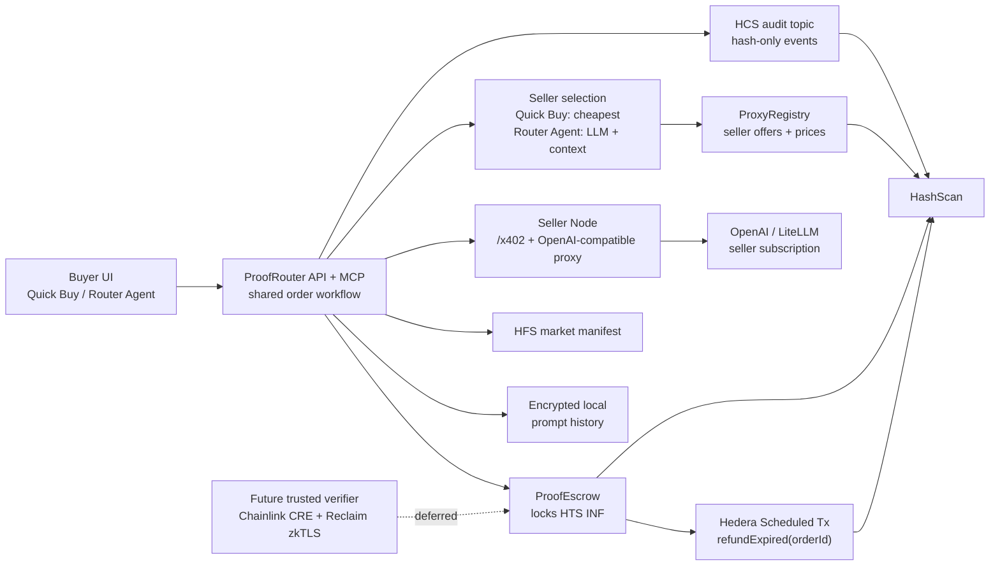
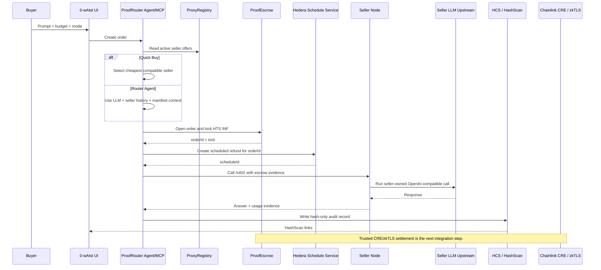
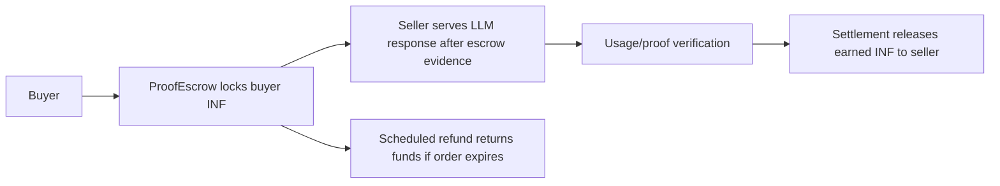

# 0-wAIst

**0-wAIst is an AI subscription de-re-seller router:** buyers submit prompts, an agent routes them to a seller running an OpenAI-compatible proxy, Hedera `INF` is locked in `ProofEscrow`, and hash-only audit evidence is written to Hedera Testnet.

In 15 seconds:

- **Buyer experience:** choose Quick Buy or Router Agent, run a real LLM request, and see HashScan evidence.
- **Seller experience:** run a seller node or LiteLLM/OpenAI-compatible proxy, publish price + endpoint to the seller registry, and serve escrow-backed calls.
- **Hedera proof points:** live HTS `INF`, live `ProxyRegistry`, live `ProofEscrow`, live seller offer, live funded escrow order, live scheduled refund creation.
- **Current honest status:** the demo path is working; trusted Chainlink CRE / real zkTLS settlement is deferred until CRE deploy access and Reclaim provider policy are ready.

Hosted frontend shell: [GitHub Pages](https://kirilligum.github.io/0-wAIst-hack-ethglobal-nyc-26/)

Live demo backend still runs locally because GitHub Pages cannot host the API/seller services.

## Demo Evidence

Live Hedera Testnet artifacts:

| Artifact | Value |
|---|---|
| HCS audit topic | `0.0.9226268` |
| HFS market manifest | `0.0.9226269` |
| HTS token | `INF` `0.0.9226625` |
| ProxyRegistry | `0.0.9226646` |
| ProofEscrow | `0.0.9229559` |
| VerifierRegistry | `0.0.9226643` |
| Seller registry offer | `1` |
| Live escrow order | `1` |
| Scheduled refund | `0.0.9229938` |

HashScan links:

- [Seller registry publish](https://hashscan.io/testnet/transaction/0.0.9186037%401781396121.704889572)
- [Funded ProofEscrow.openOrder](https://hashscan.io/testnet/transaction/0.0.9186037%401781417935.795490344)
- [Scheduled refund creation](https://hashscan.io/testnet/transaction/0.0.9186037%401781421835.290442554)
- [HFS manifest refresh](https://hashscan.io/testnet/transaction/0.0.9186037%401781389738.626703938)

## System Architecture



## Agent Router + Escrow User Flow



## What Works Now

- Vite React frontend at `http://localhost:5173`.
- ProofRouter API at `http://localhost:8787`.
- Seller node at `http://localhost:8790`.
- Real OpenAI calls for Router Agent and answer generation.
- Seller onboarding UI and `pnpm demo:seller` seller registry publication.
- Seller node `/x402` and OpenAI-compatible `/v1/chat/completions`.
- Hedera HCS/HFS/HTS helpers and live testnet artifacts.
- Live `ProofEscrow.openOrder` that locks `INF`.
- Live Hedera Scheduled Transaction targeting `refundExpired(uint256 orderId)`.
- MCP server with protocol smoke tests.
- Redacted local traces and encrypted prompt-history summaries.

## What Is Not Done Yet

- GitHub Pages hosts only the static frontend shell, not the backend services.
- Dynamic delegated wallet execution around the live buyer transaction is not complete.
- x402 facilitator wrapping around the `ProofEscrow.openOrder` call is not complete.
- Trusted Chainlink CRE / real zkTLS settlement is deferred.
- Scheduled refund was created, but post-expiry refund execution still needs to be observed.
- Native batch settlement execution for a real verified receipt remains open.

## Local Installation

Requirements:

- Node.js 22
- pnpm 10
- Hedera Testnet account
- OpenAI API key or LiteLLM/OpenAI-compatible seller upstream

```bash
pnpm install
cp .env.example .env
```

Fill at least:

```dotenv
OPENAI_API_KEY=...
OPENAI_MODEL=gpt-4.1-mini
HEDERA_NETWORK=testnet
HEDERA_OPERATOR_ID=0.0.x
HEDERA_OPERATOR_KEY=...
HEDERA_OPERATOR_EVM_ADDRESS=0x...
VITE_API_BASE_URL=http://localhost:8787
```

Run the core demo:

```bash
pnpm build
pnpm test
pnpm demo:health
pnpm dev
```

Open:

```text
http://localhost:5173
```

Useful commands:

```bash
pnpm demo:seed       # HCS/HFS seed and audit activity
pnpm demo:deploy     # HTS INF + Hedera EVM contracts
pnpm demo:seller     # publish seller offer to ProxyRegistry
pnpm demo:verifier   # local verifier placeholder setup
pnpm dev:seller      # run seller node
pnpm mcp             # run ProofRouter MCP stdio server
pnpm test:e2e        # curated local smoke path
```

## Seller Setup

A seller is someone who already has access to an LLM subscription or provider account and wants to resell calls through the 0-wAIst marketplace.

Seller responsibilities:

1. Run an OpenAI-compatible upstream such as LiteLLM, or use OpenAI directly.
2. Run `seller-node`, which exposes `/x402` and `/v1/chat/completions`.
3. Publish a seller offer with endpoint, model, prices, budget limits, and Hedera account.
4. Accept only calls that include escrow evidence for a funded `ProofEscrow` order.

Seller `.env` fields:

```dotenv
SELLER_ID=my-seller
SELLER_DISPLAY_NAME="My Seller Proxy"
SELLER_HEDERA_ACCOUNT=0.0.x
SELLER_EVM_ADDRESS=0x...
SELLER_X402_ENDPOINT=http://localhost:8790/x402
SELLER_MODEL=gpt-4.1-mini
SELLER_PROVIDER=openai-compatible
SELLER_INPUT_PRICE_PER_MTOK_INF=0.05
SELLER_OUTPUT_PRICE_PER_MTOK_INF=0.12
SELLER_FIXED_FEE_INF=0.01
SELLER_MAX_BUDGET_INF=0.5
SELLER_MAX_INPUT_TOKENS=32000
SELLER_MAX_OUTPUT_TOKENS=4000
SELLER_PUBLISH_ON_CHAIN=true
SELLER_PORT=8790

# Choose one upstream path:
OPENAI_API_KEY=...
# or
LITELLM_BASE_URL=http://localhost:4000
LITELLM_API_KEY=...
```

Run the seller node:

```bash
pnpm dev:seller
curl http://localhost:8790/health
```

Publish the seller offer:

```bash
pnpm demo:seller
```

Or use the frontend:

```text
Seller onboarding -> Become seller -> Publish seller
```

How sellers get paid:



Today the demo proves seller registration, escrow opening, seller proxy serving, and scheduled refund creation. Full automatic seller payout waits on the trusted CRE/zkTLS settlement path.

## GitHub Pages Deployment

This repo includes a GitHub Actions workflow at `.github/workflows/deploy-pages.yml`.

Manual deploy:

```bash
gh workflow run "Deploy Frontend To GitHub Pages" --ref codex/full-p0-continuation
```

The workflow builds `apps/web` with the correct Pages base path and publishes `apps/web/dist`.

Expected URL:

```text
https://kirilligum.github.io/0-wAIst-hack-ethglobal-nyc-26/
```

For the live transactional demo, run the backend locally and use `http://localhost:5173`.

## Verification

Current green checks:

```bash
pnpm build
pnpm test
pnpm test:e2e
pnpm demo:health
```

`pnpm demo:health` reports the minimal demo as ready and keeps trusted CRE completion marked blocked until the real workflow/provider credentials exist.
