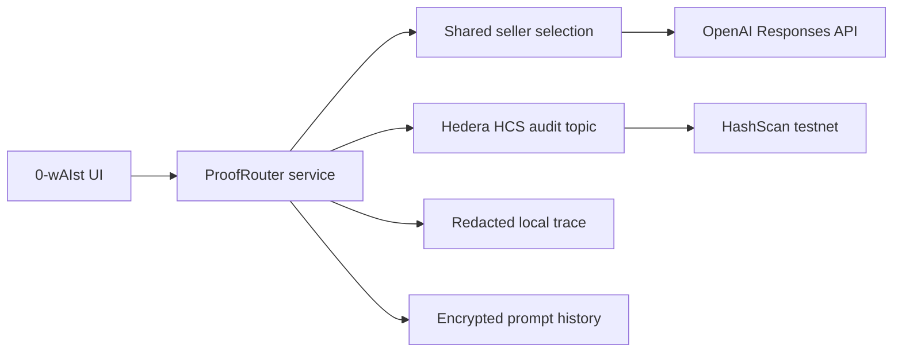
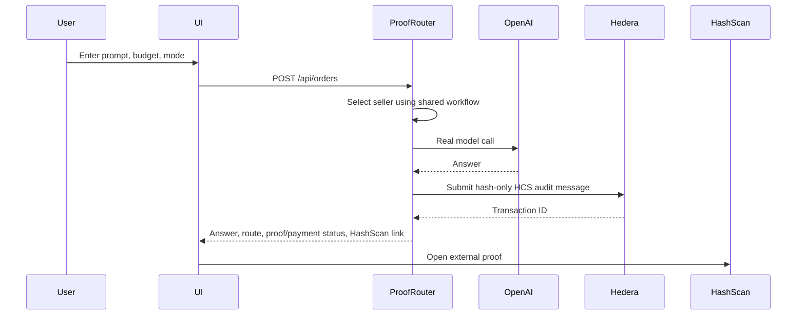

# 0-wAIst

0-wAIst routes an AI prompt to a verified subscription proxy seller, records hash-only Hedera Testnet audit activity, and keeps prompt content out of public chain artifacts.

## Demo Slice

Implemented now:

- Vite React frontend for Quick Buy and Router Agent.
- ProofRouter service with one shared execution workflow.
- Real OpenAI Responses API calls from the server.
- Hedera Testnet HCS audit transaction submission when operator credentials and an audit topic are configured.
- Hedera Testnet HTS `INF` token plus deployed `ProxyRegistry`, `ProofEscrow`, and `VerifierRegistry` contracts.
- Hedera action readiness endpoint for INF, contracts, x402 escrow, refund schedule, and batch settlement.
- HashScan links for submitted Hedera transactions.
- Local redacted traces and encrypted prompt-history summaries.
- Health checks that block full P0 claims until Hedera, Dynamic, x402, contracts, and zkTLS credentials are present.

Live Hedera Testnet demo artifacts:

- HCS audit topic: `0.0.9226268`
- HFS market manifest: `0.0.9226269`
- HTS INF token: `0.0.9226625`
- ProxyRegistry: `0.0.9226646`
- ProofEscrow: `0.0.9226648`
- VerifierRegistry: `0.0.9226643`
- Latest frontend/API-equivalent order audit: [HashScan transaction](https://hashscan.io/testnet/transaction/0.0.9186037%401781386460.953715803)
- Latest manifest refresh: [HashScan transaction](https://hashscan.io/testnet/transaction/0.0.9186037%401781389738.626703938)
- Latest seed audit sequence: `6`

The minimal scanner demo requires:

```bash
HEDERA_NETWORK=testnet
HEDERA_OPERATOR_ID=0.0.x
HEDERA_OPERATOR_KEY=...
OPENAI_API_KEY=...
```

Then run:

```bash
pnpm install
pnpm demo:seed
pnpm dev
```

Open the frontend at `http://localhost:5173`, submit a prompt, and open the HashScan link shown in the Hedera audit section.

## One Shared Product Path

```text
select seller -> hash request -> record hash-only Hedera audit -> call provider LLM -> write redacted trace -> update encrypted prompt history
```

The full PRD path still requires live Dynamic wallet delegation, Hedera x402 INF escrow, deployed EVM contracts, scheduled refunds, native batch settlement, and real zkTLS verification before it can be marked complete.

## Architecture



## Sequence



## Commands

```bash
pnpm build
pnpm test
pnpm test:e2e
pnpm demo:deploy
pnpm demo:seed
pnpm demo:health
```

`pnpm demo:health` reports two levels:

- `minimalDemo`: OpenAI plus Hedera HCS scanner demo readiness.
- `fullP0`: every locked PRD integration.

Current status: `minimalDemo.ready=true`; `fullP0.ready=false`.

## Out Of Scope For This Slice

This slice does not claim completed Dynamic login, x402 INF funding, live ProofEscrow order calls, scheduled refund execution, native Hedera batch settlement execution, or real zkTLS verification. The SDK helpers and readiness checks for scheduled refund and batch settlement exist; live execution remains blocked until there is a real funded order and verified receipt.
