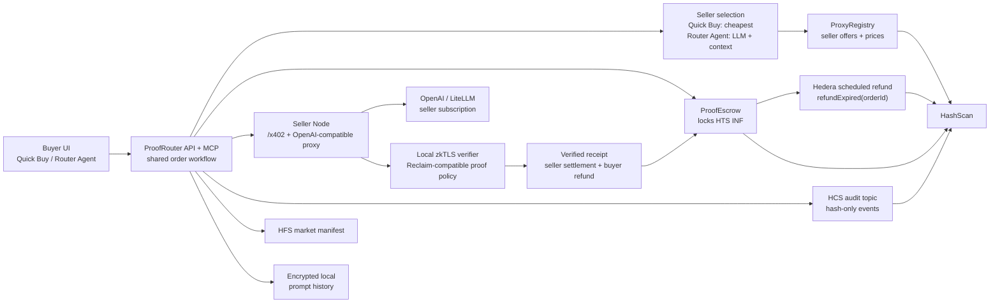
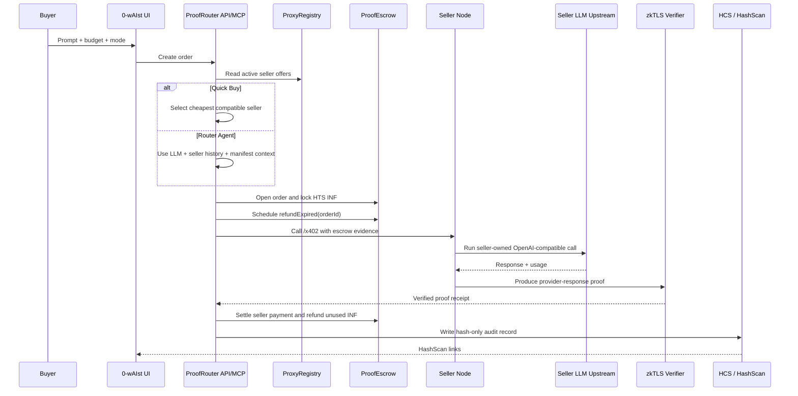

# 0-wAIst

0-wAIst is an AI subscription de-re-seller router for a local-first demo environment. Buyers submit prompts, ProofRouter selects a seller, `ProofEscrow` locks `INF`, the seller proxy calls an OpenAI-compatible upstream, zkTLS proof verifies the provider response, and Hedera records hash-only audit evidence.

In 15 seconds:

- **Buyer experience:** choose Quick Buy or Router Agent, submit a prompt, fund an escrowed order, and receive a verified seller response.
- **Seller experience:** run `seller-node`, publish price and endpoint metadata, serve escrow-backed requests, and settle only after proof verification.
- **Proof experience:** bind order id, request hash, response hash, model, endpoint, and token usage into a compact zkTLS proof package.
- **Hedera experience:** use `INF`, `ProxyRegistry`, `ProofEscrow`, `VerifierRegistry`, HCS audit messages, and the HFS market manifest from the same local workflow.

The product runs from the local development environment. Chainlink CRE is the future external verifier layer for production-grade network reports; the local path keeps the demo self-contained while preserving the same proof and settlement shape.

## Local Product Flow



## Order Sequence



## Components

- `apps/web`: Vite React UI for buyers, sellers, wallet state, order execution, and audit links.
- `services/proofrouter-mcp`: ProofRouter API, MCP server, seller selection, escrow orchestration, proof submission, settlement, and audit writing.
- `services/seller-node`: Seller endpoint with `/x402` and OpenAI-compatible `/v1/chat/completions`.
- `packages/schemas`: Shared request, response, offer, route, audit, and tool schemas.
- `packages/crypto`: Hashing, prompt redaction, local encryption, and trace-safe serialization helpers.
- `packages/hedera`: Hedera HCS/HFS/HTS/EVM helpers, escrow transaction builders, scheduled refunds, settlement batches, and verifier receipts.
- `contracts`: Solidity contracts for seller registry, verifier registry, and `ProofEscrow`.
- `demo`: Local scripts for seeding, deployment, health checks, seller publishing, verifier setup, and judge-mode execution.

## Local Environment

Requirements:

- Node.js 22
- pnpm 10
- Hedera Testnet account
- OpenAI API key or LiteLLM/OpenAI-compatible seller upstream
- Local zkTLS verifier endpoint and provider policy

Install dependencies and create a local environment file:

```bash
pnpm install
cp .env.example .env
```

Core `.env` fields:

```dotenv
OPENAI_API_KEY=
OPENAI_MODEL=gpt-4.1-mini

HEDERA_NETWORK=testnet
HEDERA_OPERATOR_ID=
HEDERA_OPERATOR_KEY=
HEDERA_OPERATOR_EVM_ADDRESS=

HCS_AUDIT_TOPIC_ID=
HFS_MARKET_MANIFEST_FILE_ID=
HTS_INF_TOKEN_ID=

PROXY_REGISTRY_CONTRACT_ID=
PROOF_ESCROW_CONTRACT_ID=
VERIFIER_REGISTRY_CONTRACT_ID=

X402_FACILITATOR_URL=
X402_NETWORK=hedera-testnet
X402_PAYMENT_ASSET=INF

ZKTLS_VERIFIER_URL=http://localhost:8788
ZKTLS_PROVIDER_POLICY_ID=
RECLAIM_PROVIDER_ID=

VITE_API_BASE_URL=http://localhost:8787
SELLER_X402_ENDPOINT=http://localhost:8790/x402
SELLER_PORT=8790
```

## Run Locally

Build and verify the workspace:

```bash
pnpm build
pnpm test
pnpm test:e2e
pnpm demo:health
```

Run the buyer/router UI and API:

```bash
pnpm dev
```

Run the seller node:

```bash
pnpm dev:seller
```

Open the app:

```text
http://localhost:5173
```

Service ports:

| Service | URL |
|---|---|
| Web app | `http://localhost:5173` |
| ProofRouter API | `http://localhost:8787` |
| Seller node | `http://localhost:8790` |
| Local zkTLS verifier | `http://localhost:8788` |

## Demo Commands

```bash
pnpm demo:seed       # create or refresh HCS/HFS demo state
pnpm demo:deploy     # deploy HTS INF and Hedera EVM contracts
pnpm demo:seller     # publish a seller offer to ProxyRegistry
pnpm demo:verifier   # configure the local verifier signer
pnpm demo:judge      # run the judge-facing local order flow
pnpm mcp             # run ProofRouter MCP over stdio
```

## Buyer Flow

Quick Buy and Router Agent share one order execution workflow. The only difference is seller selection policy:

- Quick Buy selects the cheapest compatible active seller within the buyer budget.
- Router Agent uses seller offers, Hedera seller history, market manifest metadata, and encrypted local prompt-history summaries to choose the seller.

After seller selection, both modes use the same path:

1. Build prompt, request, and response hashes.
2. Open `ProofEscrow` with `INF` locked against the selected offer.
3. Schedule `refundExpired(uint256 orderId)`.
4. Call seller `/x402` with escrow evidence.
5. Verify the seller response with zkTLS proof material.
6. Settle earned seller payment and refund unused buyer funds.
7. Write HCS audit evidence with hash-only public fields.

## Seller Flow

A seller is anyone with access to an OpenAI-compatible model endpoint who wants to resell calls through the 0-wAIst marketplace.

Seller responsibilities:

1. Run an OpenAI-compatible upstream such as LiteLLM, or use OpenAI directly.
2. Run `seller-node`, which exposes `/x402` and `/v1/chat/completions`.
3. Publish a seller offer with endpoint, model, prices, budget limits, and Hedera account.
4. Serve requests only when escrow evidence includes order id, request hash, `ProofEscrow` target, network, and `INF`.
5. Produce proof material that binds the upstream response to the settled order.

Seller `.env` fields:

```dotenv
SELLER_ID=local-seller
SELLER_DISPLAY_NAME=Local Seller Proxy
SELLER_HEDERA_ACCOUNT=
SELLER_EVM_ADDRESS=
SELLER_X402_ENDPOINT=http://localhost:8790/x402
SELLER_MODEL=gpt-4.1-mini
SELLER_PROVIDER=openai-compatible
SELLER_INPUT_PRICE_PER_MTOK_INF=0.05
SELLER_OUTPUT_PRICE_PER_MTOK_INF=0.12
SELLER_FIXED_FEE_INF=0.01
SELLER_MAX_BUDGET_INF=0.5
SELLER_MAX_INPUT_TOKENS=32000
SELLER_MAX_OUTPUT_TOKENS=4000
SELLER_PUBLISH_ON_CHAIN=true
SELLER_PORT=8790

# Choose one upstream path:
OPENAI_API_KEY=
# or
LITELLM_BASE_URL=http://localhost:4000
LITELLM_API_KEY=
```

Run and publish:

```bash
pnpm dev:seller
pnpm demo:seller
```

## Proof And Settlement

zkTLS proof is the trust boundary between seller service and seller payment. The proof package binds:

- `orderId`
- seller id and seller address
- provider host and endpoint
- model id
- request hash
- response hash
- token usage
- proof policy id

`ProofEscrow` releases seller funds only after the verified receipt matches the funded order. Unused `INF` returns to the buyer. If settlement does not happen before the deadline, `refundExpired(uint256 orderId)` returns the locked funds to the buyer.

Chainlink CRE is the future external verifier for the same compact proof package. The local environment keeps the proof loop fast for development and demos; CRE adds remote DON verification and production settlement reports.

## Hedera Audit

0-wAIst uses Hedera for public auditability and market anchoring:

- `HCS_AUDIT_TOPIC_ID`: hash-only order, proof, settlement, and timeout events.
- `HFS_MARKET_MANIFEST_FILE_ID`: seller offers, public marketplace metadata, proof policy metadata, and service endpoints.
- `HTS_INF_TOKEN_ID`: the `INF` asset locked by `ProofEscrow`.

Public artifacts include hashes, seller ids, order ids, transaction ids, schedule ids, proof policy ids, and settlement status. Public artifacts exclude plaintext prompts, raw responses, API keys, auth headers, private prompts, and raw TLS transcript data.

## MCP Tools

ProofRouter also runs as an MCP server:

```bash
pnpm mcp
```

The MCP surface exposes the same local workflow used by the UI:

- list and select seller offers
- read Hedera audit and market manifest data
- build routing context
- approve bounded `INF` allowance
- open x402-funded escrow orders
- create refund schedules
- call seller proxy
- submit proof material
- settle verified orders
- write settlement audit messages

## Verification

Use these commands before presenting the local product:

```bash
pnpm build
pnpm test
pnpm test:e2e
pnpm demo:health
pnpm demo:judge
```

The expected local run has the web app, ProofRouter API, seller node, zkTLS verifier, Hedera audit configuration, seller registry, `INF`, escrow contracts, and verifier registry configured in `.env`.
