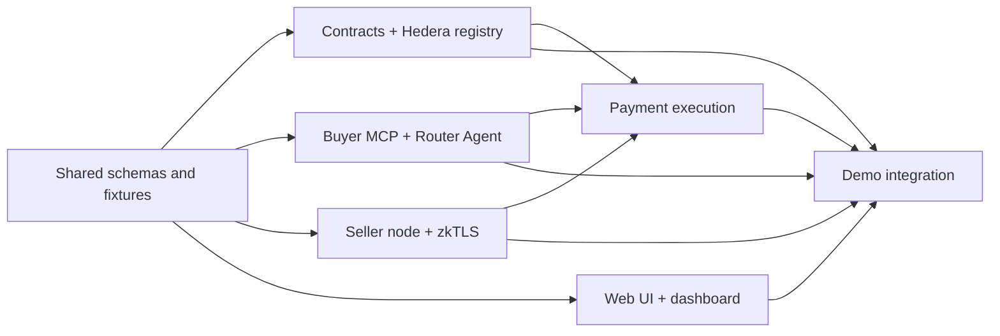

# 0-wAIst Parallel Workstream Master Plan

## Purpose

This master plan splits **0-wAIst — AI Subscription De-Re-Seller Router Agent** into decoupled monorepo workstreams so multiple Codex Desktop agents can work asynchronously without stepping on each other.

The plan preserves the product constraints from the lean BDD/TDD plan:

- One canonical inference order path.
- No legacy branches, no fallbacks, no duplicate product logic.
- Quick Buy and Router Agent differ only in seller selection.
- Product execution remains: seller selected → x402 funds `ProofEscrow` with `INF` → scheduled refund created → seller proxy call → real zkTLS receipt → Hedera Batch settlement + HCS audit.
- Public artifacts must not leak plaintext prompts or provider API keys.
- Keep the repo small and maintainable.

## Source-of-truth rules

### Canonical product path

Every workstream must integrate with this single function boundary:

```ts
executeInferenceOrder(selectedOffer, prompt, budget, modeContext)
```

This function owns:

```text
x402 escrow funding
scheduled refund creation
seller proxy call
zkTLS wait
batch settle + HCS audit
trace writing
```

No component may add an alternate final-payment path, alternate verifier path, alternate timeout path, alternate HCS topic layout, or formula-based router.

### Shared interface freeze

Work starts with the shared interface workstream. Other teams may begin from the generated fixtures, but must not change shared schemas directly.

Shared files owned by the shared-interface workstream:

```text
packages/schemas/src/offers.ts
packages/schemas/src/orders.ts
packages/schemas/src/receipts.ts
packages/schemas/src/tools.ts
packages/schemas/src/traces.ts
packages/schemas/src/promptHistory.ts
packages/crypto/src/hash.ts
packages/crypto/src/encryption.ts
packages/crypto/src/redaction.ts
features/*.feature
```

Changes to these files require a short ADR in `plans/interface-change-log.md`.

## Monorepo shape

Use the existing plan’s workspace layout rather than introducing a new repo shape:

```text
0-waist-inference/
  features/
  packages/
    schemas/
    crypto/
    hedera/
  contracts/
  services/
    proofrouter-mcp/
    seller-node/
    verifier/
  apps/
    web/
  demo/
  runs/
  plans/
```

## Workstreams

| Workstream | Branch | Primary owner files | Primary deliverable |
|---|---|---|---|
| Shared schemas and anti-debt | `work/shared-interfaces` | `packages/schemas`, `packages/crypto`, `features`, static tests | stable schemas, fixtures, no-fallback static scan |
| Contracts and Hedera registry | `work/contracts-hedera` | `contracts`, `packages/hedera/src/contracts.ts`, `packages/hedera/src/hts.ts`, `hcs.ts`, `hfs.ts`, `mirror.ts` | live registry, escrow, verifier registry, INF, one HCS topic, one HFS manifest |
| Buyer MCP and Router Agent | `work/buyer-mcp-agent` | `services/proofrouter-mcp`, prompt history, agent context | MCP tools, Quick Buy selector, Router Agent selector |
| Seller node and zkTLS verifier | `work/seller-zktls` | `services/seller-node`, `services/verifier` | funded-order gated proxy and real zkTLS receipt |
| Payment execution | `work/payment-execution` | `packages/hedera/src/dynamic.ts`, `x402.ts`, `schedule.ts`, `batch.ts`, `guardrails.ts`, execution workflow | Dynamic/x402 funding, scheduled refund, batch settlement |
| Web UI and dashboard | `work/web-ui-dashboard` | `apps/web` | simple user UI and technical dashboard |
| Demo integration and submission | `work/demo-integration` | `demo`, `README.md`, `plans`, `runs`, health/e2e scripts | `demo:health`, `demo:judge`, README-as-slides, submission evidence |

## Dependency graph



## Async development method

### Branching

Use short-lived work branches:

```text
work/shared-interfaces
work/contracts-hedera
work/buyer-mcp-agent
work/seller-zktls
work/payment-execution
work/web-ui-dashboard
work/demo-integration
```

Rules:

- Rebase from `main` before opening a PR.
- Do not merge two branches that both change shared schemas until the interface owner reviews them.
- Do not merge component branches that add fallbacks or duplicate product paths.
- Use small PRs that pass the component’s local test command.
- Integration branch can be `integration/demo-cut` after component PRs land.

### Safe parallelism

Parallel agents may work at the same time if they stay inside their owned surfaces.

Do not edit these shared files unless you are the shared-interface agent:

```text
packages/schemas/**
packages/crypto/**
features/**
tests/static/**
```

Do not edit contracts unless you are the contracts/Hedera agent:

```text
contracts/**
packages/hedera/src/contracts.ts
```

Do not edit `executeInferenceOrder` from multiple branches simultaneously. Payment execution owns it.

## Component contracts

Each component must expose only its planned boundary:

- Shared schemas: TypeScript types, Zod-style validators if used, fixtures.
- Contracts/Hedera: contract ABIs, deployment config, `packages/hedera` functions.
- Buyer MCP: MCP tools and agent decision output.
- Seller/zkTLS: seller proxy API and `VerifiedReceipt`.
- Payment execution: `executeInferenceOrder(...)`.
- Web UI: UI calls existing routes/tools; no duplicate execution logic.
- Demo integration: orchestrates scripts; does not implement core product behavior.

## No-fallback rules

The following are forbidden in product code:

```text
expireOrder
manualRefund
timeoutRefund
forceRefund
settleSequential
settleThenLog
sequential_settle_and_log
scoreRoutes
route_score
price_weight
privacy_weight
reputation_weight
weighted_score
PaymentAdapter
ChainAdapter
FallbackVerifier
demoVerifier
stubVerifier
fakeProof
mockVerifier
VERIFIER_MODE
MockVerifierService in non-test files
ERC8004AgentRegistryLite
HCS_DECISIONS_TOPIC_ID
HCS_RECEIPTS_TOPIC_ID
HFS_ALPHA_MANIFEST_FILE_ID
HFS_BETA_MANIFEST_FILE_ID
HFS_GAMMA_MANIFEST_FILE_ID
/api/tools duplicate MCP tool path
```

Mocks are allowed only inside isolated tests.

## Merge order

Fastest safe order:

1. `work/shared-interfaces`
2. `work/contracts-hedera`
3. `work/buyer-mcp-agent` and `work/seller-zktls` in parallel after shared interfaces
4. `work/payment-execution` after contracts and enough buyer/seller interfaces exist
5. `work/web-ui-dashboard` in parallel using fixtures from shared interfaces
6. `work/demo-integration` last

## Master acceptance gate

Before final submission:

```text
pnpm build
pnpm test
pnpm test:e2e
pnpm demo:deploy
pnpm demo:verifier
pnpm demo:seed
pnpm demo:judge
pnpm demo:health
```

`pnpm demo:health` may fail only with explicitly accepted external credential blockers during development. For final submission, it must pass or the README must clearly mark the blocked feature as not complete.

## Daily async handoff template

Each branch updates `plans/execution-log.md`:

```text
Branch:
Owner:
Last successful command:
Changed files:
Blocked by:
Interfaces changed:
Next recommended task:
Merge readiness:
```

## Demo-cut definition

A demo cut is valid when:

- One `orderId` appears in UI, dashboard, HCS audit, HFS manifest context, local traces, zkTLS receipt, scheduled refund trace, and batch settlement trace.
- Quick Buy and Router Agent both enter `executeInferenceOrder(...)`.
- No plaintext prompt or provider API key appears in public outputs.
- No forbidden fallback pattern exists in product source.
